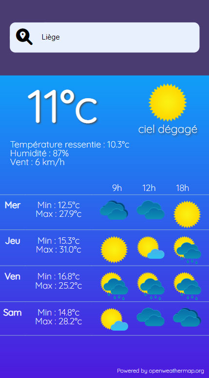

# WeatherApp
Création d'une appli météo basée sur l'API Openweathermap

A faire :
- Gérer les fuseaux horaires
  - Bloquant : heure d'été/hiver (voir "Timezone")

# Langages

- HTML
- SCSS
- Javascript

## Rendu
- Page d'accueil :

- Détail :

## Com preview
tes
> **Note:** The **Synchronize now** button is disabled if you have no file to synchronize.

# Publication

Publishing in StackEdit makes it simple for you to publish online your files. Once you're happy with a file, you can publish it to different hosting platforms like **Blogger**, **Dropbox**, **Gist**, **GitHub**, **Google Drive**, **WordPress** and **Zendesk**. With [Handlebars templates](http://handlebarsjs.com/), you have full control over what you export.

> Before starting to publish, you must link an account in the **Publish** sub-menu.

## SmartyPants

SmartyPants converts ASCII punctuation characters into "smart" typographic punctuation HTML entities. For example:

|                |ASCII                          |HTML                         |
|----------------|-------------------------------|-----------------------------|
|Single backticks|`'Isn't this fun?'`            |'Isn't this fun?'            |
|Quotes          |`"Isn't this fun?"`            |"Isn't this fun?"            |
|Dashes          |`-- is en-dash, --- is em-dash`|-- is en-dash, --- is em-dash|

