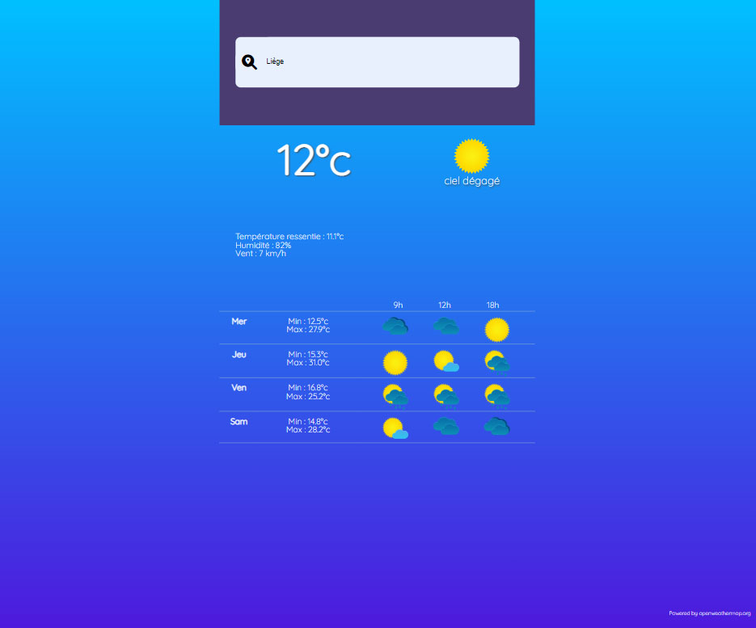

# WeatherApp
Création d'une appli météo basée sur l'API Openweathermap

A faire :
- Gérer les fuseaux horaires
  - Bloquant : heure d'été/hiver (voir "Timezone")

# Langages

- HTML
- SCSS
- Javascript

## Rendu
- Page d'accueil :

- Détail :

## A faire :

- Gérer les fuseaux horaires
  - Bloquant : heure d'été/hiver (voir "Timezone")