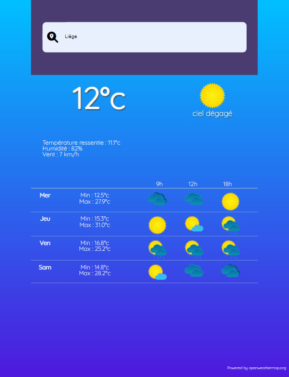

# WeatherApp
Création d'une appli météo basée sur l'API Openweathermap

# Langages

- HTML
- SCSS
- Javascript

## Rendu
- Page d'accueil :

- Détail :
L'application est en français.
Elle affiche la météo actuelle pour une ville donnée ainsi que la température ressentie, l'humidité et la vitesse du vent.
Enfin, pour les 4 prochains jours, les températures minimales, maximales et la météo à 3 différents moment de la journée.

## Lien
Github page : [Lien]([https://example.com/](https://lambertnicolas.github.io/weather-app/) "ici").

## A faire :

- Gérer les fuseaux horaires
  - Bloquant : heure d'été/hiver (voir "Timezone")
